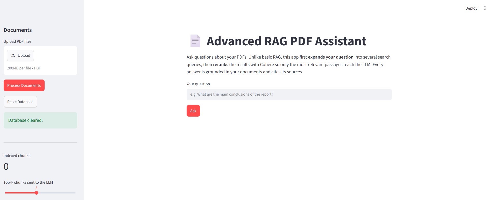
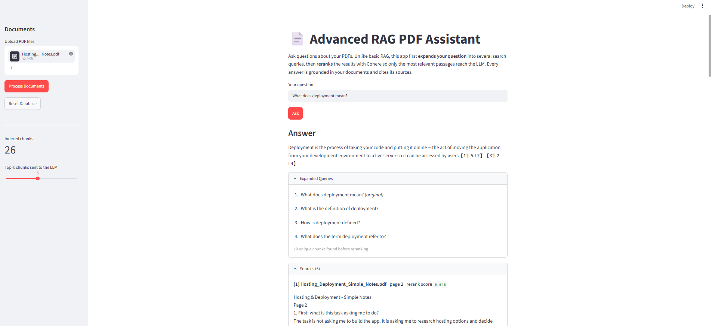

# Advanced RAG PDF Assistant

Ask questions about your own PDF documents and get answers grounded in their content, with citations.

The app improves on basic Retrieval-Augmented Generation (RAG) by expanding each question and reranking retrieved passages so only the most relevant context reaches the LLM.

## Live Demo

[Open the Advanced RAG PDF Assistant](https://advanced-rag-pdf-assistant-lz27ov26duz7bhyr2xby7y.streamlit.app/)

## Features

- 📄 **Multi-PDF upload**: upload several PDFs at once.
- ✂️ **Smart chunking**: text is split page by page, and each chunk keeps its filename, page number and chunk ID.
- 🔁 **No duplicate indexing**: re-processing the same PDF is detected and skipped.
- 🧠 **Query expansion**: a Groq-hosted LLM (default `openai/gpt-oss-120b`) writes 3 alternative versions of your question, and the original is always kept.
- 🔎 **Multi-query vector search**: every query is searched in ChromaDB using Cohere embeddings.
- 🧹 **Deduplication**: results from all queries are merged, and duplicate chunks are removed.
- 🏆 **Cohere reranking**: unique chunks are reranked against your original question with `rerank-v3.5`.
- ✅ **Grounded answers**: the LLM uses only the retrieved context and reports when the information isn't found.
- 📚 **Citations**: answers cite sources as [1], [2], and so on. Each source shows its filename, page, rerank score and text.

## How the RAG Pipeline Works

**Indexing (when you click "Process Documents")**

1. Each uploaded PDF is fingerprinted (SHA-256). If it is already indexed, it is skipped.
2. The text is extracted page by page with `PyPDFLoader`.
3. Each page is split into ~1000-character chunks with 200 characters of overlap.
4. Chunks are embedded with Cohere (`embed-english-v3.0`) and stored in a local ChromaDB database.

**Answering (when you click "Ask")**

1. **Expand**: Groq generates 3 alternative phrasings of the question.
2. **Retrieve**: ChromaDB is searched with all 4 queries (the original plus 3 alternatives).
3. **Merge and deduplicate**: results are combined, and repeated chunks are removed.
4. **Rerank**: Cohere scores every unique chunk against the original question.
5. **Select**: only the top-k chunks are kept (top-k is set in the sidebar).
6. **Generate**: Groq writes an answer from those chunks only, citing them as [1], [2], and so on.

## Architecture

```
                         ┌──────────────────────┐
  PDF files ───────────▶ │  document_processor  │  PyPDFLoader + text splitter
                         └──────────┬───────────┘
                                    │ chunks + metadata (file, page, chunk_id)
                                    ▼
                         ┌──────────────────────┐
                         │ ChromaDB (local disk)│ ◀── Cohere embeddings
                         └──────────┬───────────┘
                                    │
  Question ──▶ Groq: expand into 3 alternative queries (+ original)
                                    │
                                    ▼
               Vector search for each query ──▶ merge ──▶ remove duplicates
                                    │
                                    ▼
               Cohere rerank-v3.5 (against the original question) ──▶ top-k chunks
                                    │
                                    ▼
               Groq LLM (GROQ_MODEL) ──▶ grounded answer with [1] [2] citations + sources
```

## Technologies Used

| Purpose                           | Technology                                                                                                           |
| --------------------------------- | -------------------------------------------------------------------------------------------------------------------- |
| User interface                    | [Streamlit](https://streamlit.io/)                                                                                   |
| LLM (query expansion and answers) | [Groq](https://groq.com/), `openai/gpt-oss-120b` by default (configurable via `GROQ_MODEL`)                          |
| Embeddings                        | [Cohere](https://cohere.com/), `embed-english-v3.0`                                                                  |
| Reranking                         | Cohere, `rerank-v3.5`                                                                                                |
| Vector database                   | [ChromaDB](https://www.trychroma.com/)                                                                               |
| Orchestration                     | [LangChain](https://www.langchain.com/) (`langchain-core`, `langchain-chroma`, `langchain-cohere`, `langchain-groq`) |
| PDF parsing                       | `pypdf` via LangChain's `PyPDFLoader`                                                                                |

## Project Structure

```
advanced-rag-pdf-assistant/
├── app.py                    # Streamlit interface
├── rag/
│   ├── __init__.py
│   ├── document_processor.py # PDF loading, chunking, metadata
│   ├── retrieval.py          # ChromaDB store, multi-query search, dedup, Cohere reranker
│   └── pipeline.py           # Query expansion, grounded answer generation, full pipeline
├── screenshots/              # Screenshots for this README
├── requirements.txt
├── .env.example              # Template for your API keys
├── .gitignore
└── README.md
```

## Installation

Requires **Python 3.10+**.

```bash
git clone https://github.com/<your-username>/advanced-rag-pdf-assistant.git
cd advanced-rag-pdf-assistant

python -m venv .venv
# Windows
.venv\Scripts\activate
# macOS / Linux
source .venv/bin/activate

pip install -r requirements.txt
```

## Environment Variables

Copy the example file and add your keys:

```bash
# Windows
copy .env.example .env
# macOS / Linux
cp .env.example .env
```

| Variable         | Description                                                                                                                                                           |
| ---------------- | --------------------------------------------------------------------------------------------------------------------------------------------------------------------- |
| `GROQ_API_KEY`   | Required. Get one at https://console.groq.com/keys                                                                                                                    |
| `COHERE_API_KEY` | Required. Get one at https://dashboard.cohere.com/api-keys                                                                                                            |
| `GROQ_MODEL`     | _Optional._ The Groq model used for query expansion and answers. Defaults to `openai/gpt-oss-120b`. Use any chat model listed at https://console.groq.com/docs/models |

Both services offer free tiers. `.env` is git-ignored, so your keys are never committed. If a key is missing, the app shows a clear message instead of crashing.

## How to Run

```bash
streamlit run app.py
```

The app opens at http://localhost:8501.

## Example Usage

1. In the sidebar, upload one or more PDFs (for example, a research paper and a company report).
2. Click **Process Documents**. The "Indexed chunks" counter goes up.
3. Type a question such as _"What methodology did the authors use?"_ and click **Ask**.
4. Read the answer. Citations like **[1]** point to the numbered sources.
5. Open **Expanded Queries** to see the alternative searches the app ran.
6. Open **Sources** to see the filename, page number, rerank score and text of each chunk.
7. Ask something unrelated to your PDFs. The app replies that the information was not found in the uploaded documents.

Use the **top-k** slider to control how many reranked chunks are sent to the LLM. Use **Reset Database** to clear all indexed documents.

## Screenshots

> Add your screenshots to the `screenshots/` folder and they will appear here.

| Main interface                          | Answer with sources                            |
| --------------------------------------- | ---------------------------------------------- |
|  |  |
